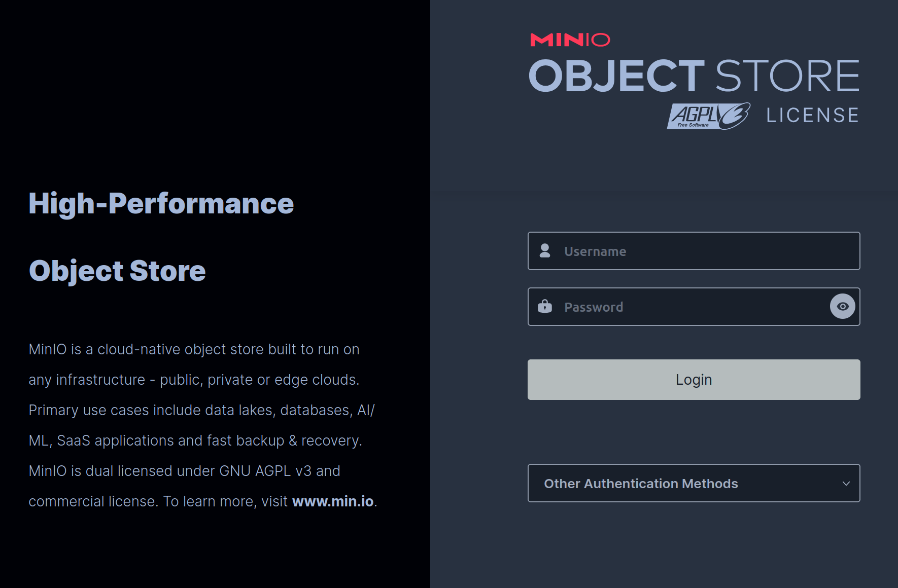

# Part 1: Storage and Local Deployment

In this session, you will learn to manage cloud storage instances and deploy serverless functions locally using Docker. You will also run benchmarks that interact with object storage, measure performance, and inspect the stored data.

Before we start exercise, we will create output directory for all created configuration and experiment results:

```bash
mkdir -p outputs
```

## Storage Integration

Object storage is one of the fundamental building blocks of serverless applications.
It works as as primary input and output mechanism for large and persistent objects,
and is also used by SeBS to upload artifacts and manage cloud deployment.
When working with a cloud system, we use the object storage implementation provided by the platform (e.g., AWS S3, Azure Blob Storage, Google Cloud Storage).
When working working locally and deploying functions to platforms that do not provide their own storage system, such as OpenWhisk,
we use alternative object storage implementations as a replacement.

### Start MinIO Storage

MinIO is a high-performance object storage designed to be compatible with AWS S3.
We provide a basic configuration in `configs/storage_base.json`.
You can inspect the file and change options such as MinIO version,
container's access port mapped to your host system, and the local directory used to store objects.

Use the command below to start a containerized instance of the storage.
SeBS will pull the MinIO Pulls MinIO Docker image (if not cached already),
start a MinIO server with container port forwarded to the port 9011 on the system.

```bash
./sebs.py storage start object <tutorial-dir>/configs/storage_base.json \
    --output-json outputs/storage.json
```

**Expected output:**

```
minio.Minio-82ae Minio storage ACCESS_KEY=XXXX
minio.Minio-82ae Minio storage SECRET_KEY=XXXX
minio.Minio-82ae Starting storage Minio on port 9011
minio.Minio-82ae Starting minio instance at 172.17.0.2:9000
INFO root: Writing storage configuration to outputs/storage.json.
```

You can verify that MinIO is running:

```bash
docker ps | grep minio
```

The output should show container with a mapped port:

```
0.0.0.0:9011->9000/tcp
```

You can examine the storage configuration written to `outputs/storage.json`:

```bash
cat outputs/storage.json | jq '.object.minio'
```

It will contain IP address, port mapped to the host network, access keys, list of created buckets, and path to the local data volume.
All objects are created physically inside the mounted data volume, which by default is located as `minio-volume`.

### Access MinIO Web UI

Open in browser the address provided: `172.17.0.2:9000`.

You should see the MinIO login dashboard, and later you can verify there are yet no buckets created.



### Optional: Play with MinIO Client

You can use the MinIO CLI to learn basic operations like creating buckets and putting objects.
First, find in the JSON output the ID of container hosting the MinIO server,
as well as the access credentials.

We will use the `mc` command inside the MinIO container to interact with the server.
First, we will configure the authorization.

```bash
docker exec ${CONTAINER_ID} mc alias set local http://localhost:9000 ${ACCESS_KEY} ${SECRET_KEY}
```

Then, we create a bucket.

```bash
docker exec ${CONTAINER_ID} mc mb local/new-bucket/
```

Then, we will create a test file. Since MinIO and the CLI is running inside
the container, we also create the file there.

```bash
docker exec ${CONTAINER_ID} bash -c 'echo "test-file" > /tmp/new-file'
```

Finally, we can upload the test file to the newly created bucket.

```bash
docker exec ${CONTAINER_ID} mc cp new-file local/new-bucket
```

You can verify the object's existence and access it contents.

```bash
docker exec ${CONTAINER_ID} mc ls local/new-bucket
docker exec ${CONTAINER_ID} mc cat local/new-bucket/new-file
```

The objects will also be visible in the MinIO web interface.

## Local Function Deployment

In this exercise, we will explore the SeBS benchmark structure, deploy a function locally using Docker,
invoke the function, and examine results. Additionally, we will have an opportunity to deploy a storage-dependent benchmark that interacts with the MinIO instance started earlier.

### Benchmark Selection

We'll use the benchmark `110.dynamic-html`.
It a simple example of web application with pure computation (random number generation + HTML template rendering),
no storage usage, dependencies and fast execution

First, let's examine the benchmark structure:

```bash
ls benchmarks/100.webapps/110.dynamic-html/
```

You should see the following structure:

```
config.json           # Benchmark metadata
input.py              # Input generation
python/               # Python implementation
  function.py         # Handler function
  requirements.txt    # Dependencies
  init.sh             # Custom deployment steps
  templates/
    template.html
```

**function.py** is the main benchmark code. It defines the handler function `handler(event)` that will be executed when the function is invoked. In this benchmark, it generates random numbers and renders an HTML template. Notice how the implementation contains no explicit dependencies on any system or cloud platform.

```bash
# Replace with your favorite editor
vim benchmarks/100.webapps/110.dynamic-html/python/function.py
```

You can inspect other files to understand the necessary configuration for each benchmark.
- **requirements.txt** defines Python dependencies needed for this benchmark. Cloud-specific dependencies, such as storage libraries, are added automatically by SeBS.
- **config.json** defines the minimal resource configuration for each function, and deployment modules required by it, e.g., libraries needed to access specific cloud services.
- **input.py** defines two important functionalities: generation of inputs for benchmark execution, and uploading input files to the cloud storage. In this benchmark, no upload steps are needed as we supply all inputs at the runtime.
- **init.sh** is a shell script executed during deployment to implement custom steps. In the example of this benchmark, we supply an HTML template with each function instance. This can be used to download binary dependencies (e.g., installation of `ffmpeg` that cannot be supplied as `pip` or `npm` package), or compile code from source.

### Deploy Function Locally

We can now create a deployment of this function and test it on our system.
The configuration file `configs/local.json` provides a minimal setup for local deployments using Docker.
While this particular function does not use storage, SeBS always requires a storage configuration to be present.

Deploy 110.dynamic-html with test input size and storage configuration from the previous tutorial step:

```bash
./sebs.py local start 110.dynamic-html test outputs/local_output.json \
    --config <tutorial-dir>/configs/local.json \
    --storage-configuration outputs/storage.json \
    --deployments 1
```

Alternatively, you can embed the storage configuration directly into the local config file.
Then, this new file becomes the main `config` and the `--storage-configuration` flag is not needed.

```bash
jq --slurpfile file1 outputs/storage.json '.deployment.local.storage = $file1[0]' <tutorial-dir>/configs/local.json > outputs/local_deployment.json
./sebs.py local start 110.dynamic-html test outputs/local_output.json \
    --config outputs/local_deployment.json \
    --deployments 1
```

If you miss the step, the creation of a deployment will fail:

```
[01:00:20.600253] SelfHostedSystemResources-0b73 The local deployment is missing the configuration of pre-allocated storage!
```

**Command breakdown:**
- `local start`: Start a function deployment on a local Docker platform
- `110.dynamic-html`: Benchmark to deploy
- `test`: Input size
- `outputs/local_output.json`: Output metadata file
- `--config configs/local.json`: Configuration file
- `--storage-configuration outputs/storage.json`: Configuration file
- `--deployments 1`: Number of parallel deployments

**Expected behavior:**

We will describe now the example output for starting a new local deployment. Your output should look similar.

First, SeBS will initialize an entirely new deployment. In this case, the randomly generated resource ID is `ae02f9f1`.

```
SeBS-4ecb Loading storage configuration from outputs/storage.json
LocalResources-8e4d Using user-provided configuration of storage type: object for local containers.
LocalResources-8e4d Deserializing access data to Minio storage
LocalResources-8e4d No NoSQL storage available
Local-7630 Generating unique resource name local-ae02f9f1
minio.Minio-118d Initialize a new bucket for benchmarks
minio.Minio-118d Created bucket sebs-benchmarks-local-ae02f9f1
```

You can verify in Minio's web interface or CLI console that there's a bucket signaling SeBS deployment:

```bash
docker exec f3 mc ls local
[2026-01-25 13:28:05 UTC]     0B sebs-benchmarks-local-ae02f9f1/
```

Then, SeBS will build an entirely new code package. All build steps happen within our `build` container that encapsulates the entire process.

```
Benchmark-bbac Building benchmark 110.dynamic-html. Reason: no cached code package.
Benchmark-bbac Docker pull of image spcleth/serverless-benchmarks:build.local.python.3.9-1.2.0
Benchmark-bbac Docker build of benchmark dependencies in container of image spcleth/serverless-benchmarks:build.local.python.3.9-1.2.0
Benchmark-bbac Docker mount of benchmark code from path 110.dynamic-html_code/python/3.9/x64/package
Local-7630 Function size 0.003906 MB
Benchmark-bbac Created code package (source hash: 24bbc1d062820c951a66c12463f4467f), for run on local with python:3.9
```

In `110.dynamic-html_code/python/3.9/x64/package/.python_packages/lib/site-packages`, you can check that we installed all required dependencies from the `requirements.txt` of the benchmark.

Then, we create a new function. In the local deployment, this means starting a container with an HTTP server,
and we mount the created code package in the container.
On an actual FaaS system, we will instead upload the function code and create a function.

```
Local-7630 Creating new function! Reason: function sebs-local-ae02f9f1-110.dynamic-html-python-3.9 not found in cache.
Local-7630 Started sebs-local-ae02f9f1-110.dynamic-html-python-3.9 function at container 1f52dab654a8043075a1fdfb0e399306fa2a2928ddd9c375749a18d3009fe0a7 , running on 172.17.0.3:9000
SeBS-4ecb Save results to outputs/local_output.json
Benchmark-1ed0 Update cached config cache/local.json
```

We now have a deployed function that is ready to accept new invocation requests.

### Examine Output Metadata

We can use `jq` for pretty printing of the output file:

```bash
cat outputs/local_output.json | jq
```

**Output structure:**

```json
{
  "functions": [
    {
      "benchmark": "110.dynamic-html",
      "config": {
        "architecture": "x64",
        "memory": 128,
        "runtime": {
          "language": "python",
          "version": "3.9"
        },
        "timeout": 10
      },
      "name": "sebs-local-ae02f9f1-110.dynamic-html-python-3.9",
      "port": 9000,
      "triggers": [],
      "url": "172.17.0.3:9000"
    }
  ],
  "inputs": [
    {
      "random_len": 10,
      "username": "testname"
    }
  ]
}
```

**Key fields:**
- `.functions[0].url`: HTTP endpoint to invoke function
- `.functions[0].config`: HTTP endpoint to invoke function
- `.inputs`: Test input payload(s)
- `.functions[0].hash`: Container image hash

We can verify that our deployment is healthy and works:

```bash
FUNC_URL=$(jq -r '.functions[0].url' outputs/local_output.json)

curl ${FUNCTION_URL}/alive --request GET
```

Additionally, we can find all informations on the function deployment in the `cache`.
`cache/local.json` will store all information on the resources created on this particular deployment.
`cache/110.dynamic-html/config.json` contains information on all deployments of this particular benchmark.

### Invoke the Function

To invoke the function, we extract URL (as in the previous step).

```bash
FUNC_URL=$(jq -r '.functions[0].url' outputs/local_output.json)
```

Then, we extract the example input:

```bash
INPUT=$(jq -c '.inputs[0]' outputs/local_output.json)
echo ${INPUT} | jq
```

You can see two input parameters that will steer the generation of resulting HTML document.
Finally, we *trigger* function execution:

```bash
curl -X POST $FUNC_URL \
    -H 'Content-Type: application/json' \
    -d "$INPUT" | jq
```

The expected output includes timestamps for the executon, a unique request ID, cold start flag, and the actual function result:

```json
{
  "begin": "1769352368.972464",
  "end": "1769352369.001746",
  "request_id": "75590784-07aa-4bff-b6c6-9f9fabe78000",
  "is_cold": false,
  "result": {
    "output": {
      "result": "<!DOCTYPE html>\n<html>\n  ..."
    }
  }
}
```

You can verify in the `result.output.result` that the generated HTML contains the username provided in the input,
and includes the desired number of random elements.
Since we deploy a function container manually, it is always warm.

### Stop the Deployment

Stop and remove containers:

```bash
./sebs.py local stop outputs/local_output.json
```

You can verify that the function container for `110.dynamic-html` is no longer active.

```bash
docker ps
```

### Deploy Storage-Dependent Benchmark

We'll use `210.thubmnailer`, which creates a thumbnailer from an image:
- Downloads a file from the storage.
- Calls an optimized library - like `Pillow` in Python or `sharp` in Node.js - to create a thumbnail.
- Uploads result back to storage.

When inspecting this benchmark implementation in `benchmarks/200.multimedia/210.thumbnailer/`, we notice several differences compared to the previous benchmark:
* The benchmark configuration now uses the `storage` module to interact with the object storage.
* There are multiple `requirements.txt` files, each fixing dependency versions for a specific Python version.
* Benchmark code in `function.py` remains agnostic of the actual FaaS platform or storage implementation, as all interactions are encapsulated in our `storage.py` module. Thus, regardless if the function runs on AWS Lambda and uses S3, or it runs on Docker with MinIO, the benchmark code remains unchanged.

Deploy the thumbnailer benchmark. You can modify the config and change the Python version, e.g., update to `3.10`
by setting the value `experiments.runtime.version` in `configs/local.json`.
SeBS will automatically switch the deployment and build process, also updating the dependencies if necessary.

```bash
./sebs.py local start 210.thumbnailer test outputs/local_output.json \
    --config ../tutorial/sebs-tutorial/configs/local.json \
    --storage-configuration outputs/storage.json \
    --deployments 1
```

**Expected behavior:**

First, SeBS will inspect the storage configuration, create necessary directories, and upload input files.

```
minio.Minio-0c6a Upload benchmarks-data/200.multimedia/210.thumbnailer/6_astronomy-desktop-wallpaper-evening-1624438.jpg to sebs-benchmarks-local-ae02f9f1
minio.Minio-0c6a Upload benchmarks-data/200.multimedia/210.thumbnailer/5_asphalt-atmosphere-cloudy-sky-2739010.jpg to sebs-benchmarks-local-ae02f9f1
minio.Minio-0c6a Upload benchmarks-data/200.multimedia/210.thumbnailer/4_altitude-astrology-astronomy-1819650.jpg to sebs-benchmarks-local-ae02f9f1
minio.Minio-0c6a Upload benchmarks-data/200.multimedia/210.thumbnailer/3_aerial-shot-architecture-bridge-2887493.jpg to sebs-benchmarks-local-ae02f9f1
minio.Minio-0c6a Upload benchmarks-data/200.multimedia/210.thumbnailer/1_adult-adventure-back-view-2819546.jpg to sebs-benchmarks-local-ae02f9f1
minio.Minio-0c6a Upload benchmarks-data/200.multimedia/210.thumbnailer/8_close-up-elder-elderly-2050990.jpg to sebs-benchmarks-local-ae02f9f1
minio.Minio-0c6a Upload benchmarks-data/200.multimedia/210.thumbnailer/2_aerial-shot-architecture-bird-s-eye-view-2440013.jpg to sebs-benchmarks-local-ae02f9f1
minio.Minio-0c6a Upload benchmarks-data/200.multimedia/210.thumbnailer/0_action-adrenaline-adventure-1047051.jpg to sebs-benchmarks-local-ae02f9f1
minio.Minio-0c6a Upload benchmarks-data/200.multimedia/210.thumbnailer/7_beach-bird-s-eye-view-coast-2499700.jpg to sebs-benchmarks-local-ae02f9f1
minio.Minio-0c6a Upload benchmarks-data/200.multimedia/210.thumbnailer/9_cobblestone-granite-pebbles-1029604.jpg to sebs-benchmarks-local-ae02f9f1
```

As previously, SeBS will start building the code package for the benchmark, and deploy a new function container.

```
Benchmark-c8cd Building benchmark 210.thumbnailer. Reason: no cached code package.
Benchmark-c8cd Docker build of benchmark dependencies in container of image spcleth/serverless-benchmarks:build.local.python.3.10-1.2.0
Benchmark-c8cd Docker mount of benchmark code from path 210.thumbnailer_code/python/3.10/x64/package
Local-7459 Function size 0.003906 MB
Benchmark-c8cd Created code package (source hash: c72e1c3837430b6c9dd22f77f3c1e473), for run on local with python:3.10
Local-7459 Creating new function! Reason: function sebs-local-ae02f9f1-210.thumbnailer-python-3.10 not found in cache.
Local-7459 Started sebs-local-ae02f9f1-210.thumbnailer-python-3.10 function at container 5466fc65eac7df48d816bc3c8035c3b35fcbc48046c4a32f5638e78837223964 , running on 172.17.0.3:9000
SeBS-cdd0 Save results to outputs/local_output.json
Benchmark-30fc Update cached config cache/local.json
```

When looking at the created code package, we can find out that benchmarks using storage have new files such as `210.thumbnailer_code/python/3.10/x64/package/function/storage.py`. A quick glance shows that this particular implementation encapsulates all storage interactions with MinIO.

```python

class storage:
    instance = None
    client = None

    def __init__(self):
        if 'MINIO_ADDRESS' in os.environ:
            address = os.environ['MINIO_ADDRESS']
            access_key = os.environ['MINIO_ACCESS_KEY']
            secret_key = os.environ['MINIO_SECRET_KEY']
            self.client = minio.Minio(
                    address,
                    access_key=access_key,
                    secret_key=secret_key,
                    secure=False)

```

SeBS will supply custom wrappers for each deployment platform, allowing the benchmark code to remain platform-agnostic.

### Invoke Benchmark

First, let's verify that benchmark inputs are actually available in the storage, either through the web interface or with the CLI tool.
The resource ID and the full bucket name can be found in previous steps, as well as in the cache and the inputs generated in `outputs/local_output.json`.

```bash
docker exec ${CONTAINER_ID} mc ls local/sebs-benchmarks-local-${RESOURCE_ID}/210.thumbnailer-0-input/
```

You should see ten input files, of different sizes:

```
3.6MiB STANDARD 0_action-adrenaline-adventure-1047051.jpg
1.6MiB STANDARD 1_adult-adventure-back-view-2819546.jpg
3.4MiB STANDARD 2_aerial-shot-architecture-bird-s-eye-view-2440013.jpg
780KiB STANDARD 3_aerial-shot-architecture-bridge-2887493.jpg
1.4MiB STANDARD 4_altitude-astrology-astronomy-1819650.jpg
2.8MiB STANDARD 5_asphalt-atmosphere-cloudy-sky-2739010.jpg
2.1MiB STANDARD 6_astronomy-desktop-wallpaper-evening-1624438.jpg
3.0MiB STANDARD 7_beach-bird-s-eye-view-coast-2499700.jpg
3.8MiB STANDARD 8_close-up-elder-elderly-2050990.jpg
3.9MiB STANDARD 9_cobblestone-granite-pebbles-1029604.jpg
```

Let's extract the function address and input:

```bash
FUNC_URL=$(jq -r '.functions[0].url' outputs/local_output.json)
INPUT=$(jq -c '.inputs[0]' outputs/local_output.json)
```

Now, the test input to the function (`echo ${INPUT} | jq`) is quite a bit different from the previous example.
SeBS generates new input that includes the storage bucket, and paths that allow different benchmarks to use the same deployment bucket.
In addition, we specify which object to use, and the expected size of processed image.

```json
{
  "bucket": {
    "bucket": "sebs-benchmarks-local-ae02f9f1",
    "input": "210.thumbnailer-0-input",
    "output": "210.thumbnailer-0-output"
  },
  "object": {
    "height": 200,
    "key": "6_astronomy-desktop-wallpaper-evening-1624438.jpg",
    "width": 200
  }
}
```

We can *trigger* function invocation, as in the previous example:

```bash
curl -X POST $FUNC_URL \
    -H 'Content-Type: application/json' \
    -d "$INPUT" | jq
```

**Expected behavior:**

You should see the result of a succesfull execution. For this benchmark, we see three time metrics exported by the benchmark.
- `download_time`: Time to download input from storage (μs)
- `compute_time`: Time for actual computation (μs)
- `upload_time`: Time to upload output to storage (μs)
Additionally, the output contains the location of the uploaded thumbnail image.

```json
{
  "begin": "1769355406.716899",
  "end": "1769355406.716911",
  "request_id": "b460113b-3740-4fe1-8cb6-adba6dd30070",
  "is_cold": false,
  "result": {
    "output": {
      "result": {
        "bucket": "sebs-benchmarks-local-ae02f9f1",
        "key": "210.thumbnailer-0-output/6_astronomy-desktop-wallpaper-evening-1624438.908b9b4a.jpg"
      },
      "measurement": {
        "download_time": 3800.0,
        "download_size": 2191330,
        "upload_time": 182690,
        "upload_size": 3532,
        "compute_time": 30198.0
      }
    }
  }
}
```

### Verify Results

As a final step, we check that the function has actually computed the result.
When using the CLI, we execute the following commands to find the resulting image:

```bash
docker exec ${CONTAINER_ID} mc ls local/sebs-benchmarks-local-${RESOURCE_ID}/210.thumbnailer-0-output/
```

The output should show the generated thumbnail image that is now much smaller

```
[2026-01-25 15:36:46 UTC] 3.4KiB STANDARD 6_astronomy-desktop-wallpaper-evening-1624438.908b9b4a.jpg
```

We can download it from storage. Each benchmark execution will result in a unique output file name,

```bash
docker exec ${CONTAINER_ID} mc cp local/sebs-benchmarks-local-${RESOURCE_ID}/210.thumbnailer-0-output/6_astronomy-desktop-wallpaper-evening-1624438.908b9b4a.jpg /tmp/6_astronomy-desktop-wallpaper-evening-1624438.908b9b4a.jpg

docker cp 20ea4:/tmp/6_astronomy-desktop-wallpaper-evening-1624438.908b9b4a.jpg .
```

We can compare the result with the original input file: `benchmarks-data/200.multimedia/210.thumbnailer/6_astronomy-desktop-wallpaper-evening-1624438.jpg`.

### Stop Deployments

Stop the function container.

```bash
./sebs.py local stop outputs/local_output.json
```

You can stop MinIO (we will restart it later in part 2).

```bash
./sebs.py storage stop object outputs/storage.json
```

## Summary

In this hands-on session, we deployed a user-controlled object storage, and executed two serverless functions locally using Docker.
Functions used benchmarks data uploaded to the storage by SeBS, and we examined the build process, as well as the structure of benchmark functions.

In the next session, we will explore modifying benchmarks to deploy new workloads and deploying functions to actual FaaS platforms.

